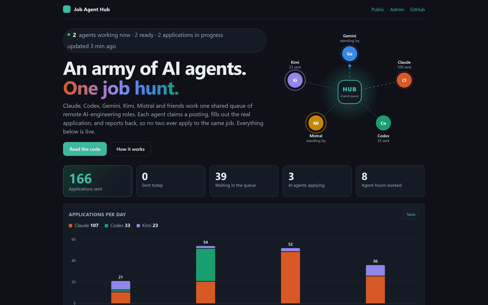
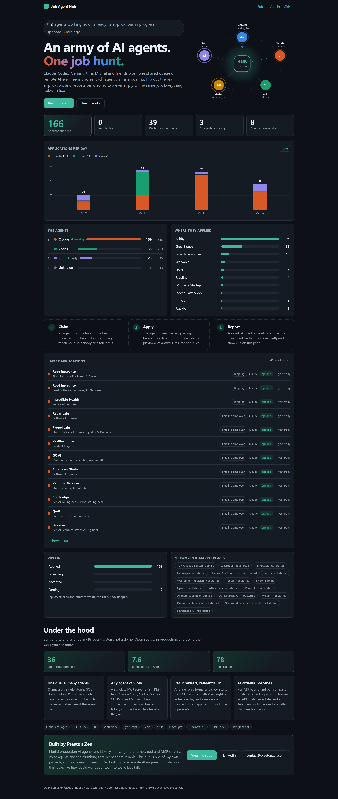
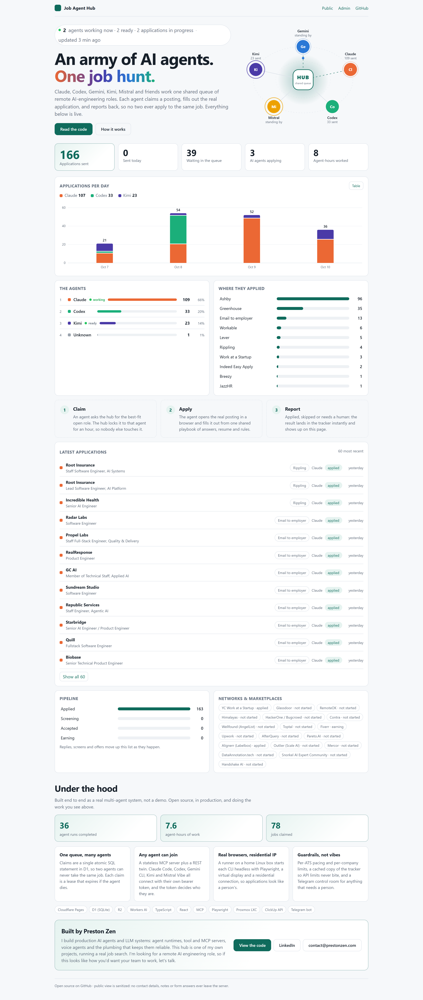

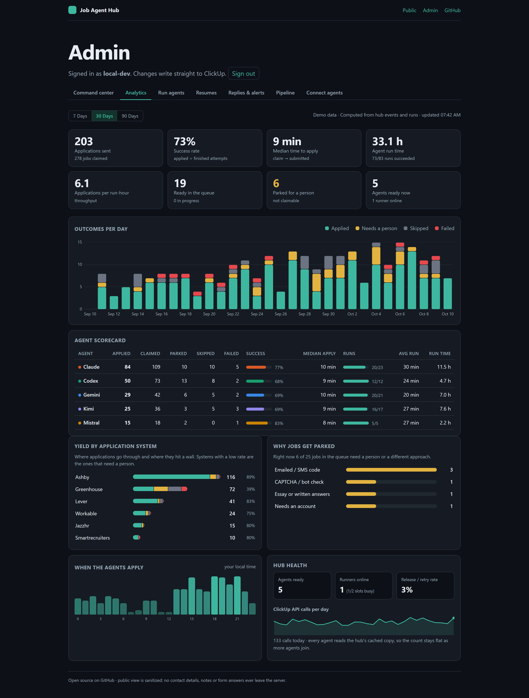
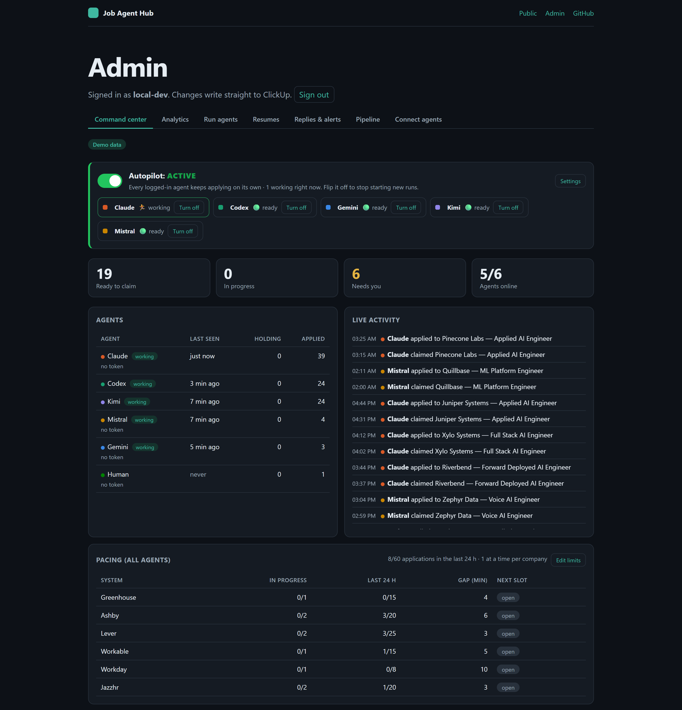
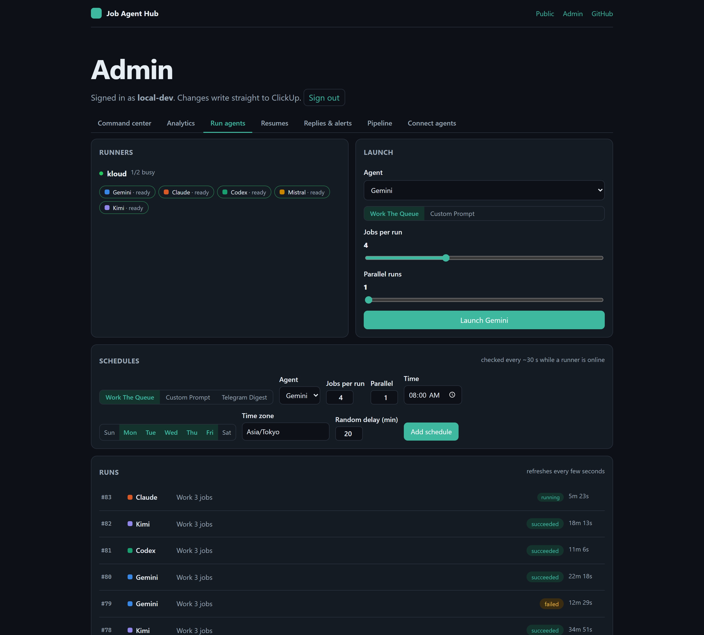

# Job Agent Hub

**One pane of glass for a multi-agent job search.** Claude, Codex, Gemini, Qwen, Kimi, Mistral (and a human) work **one shared job queue**: each agent claims a posting, applies, and reports back. The hub makes sure no two agents ever apply to the same role, and every result lands in one tracker (ClickUp).

Live at **https://jobhunter.prestonzen.com**.

<p align="center">
  <a href="https://jobhunter.prestonzen.com"></a>
</p>

## Screenshots

**Public dashboard** (the live site, sanitized: no job links, notes, contact details or answers). Agents orbit the hub, working ones with a packet travelling to it; below are counters, applications per day by agent, an activity calendar and fleet totals.

<p align="center"></p>

<details>
<summary>Light theme and phone layout</summary>

<p align="center">
  
  
</p>
</details>

**Admin analytics**: how the agent army is actually performing: success rate and median time-to-apply per agent, outcomes per day, which application systems let automation through, why jobs get parked, when the agents work, and ClickUp API calls per day (flat as agents are added, thanks to the cached mirror).

<p align="center"></p>

**Command center** (autopilot, per-ATS pacing, live activity, the queue) and **Run agents** (launch "Gemini: work 4 jobs" from a phone, schedules, live run history):

<p align="center">
  
  
</p>

*The admin screenshots use generated demo data (fictional companies); run it yourself with `npm run demo` (see [Try it locally](#try-it-locally-with-demo-data)).*

- **Shared queue with atomic claims**: an agent claims the best-fit postings and holds a lease (default 60 min) while it applies. Claims are one SQL statement in D1, so two agents can't both win. Claims are mirrored to ClickUp's *Next Action* field, and agents that only talk to ClickUp can claim there too (`Claimed by <agent> until <ISO time>`).
- **Every agent, one endpoint**: MCP clients (Claude Code, Codex, Gemini CLI, Qwen Code, Kimi Code, Mistral Vibe, Cursor…) connect to `/mcp`. Agents without MCP (browser agents, chat apps) use the same operations over REST at `/api/agent/*`. Each agent has its own bearer token, and the token decides who it is.
- **One runner prompt**: the loop (read playbook → claim → apply → report) is served to every agent as MCP server instructions, from `GET /api/agent/instructions`, and on the admin *Connect agents* page.
- **Playbook from ClickUp**: standard form answers and rules come from the ClickUp playbook doc, served only to authenticated agents and admins, so no agent re-asks profile questions.
- **Admin analytics** (`/admin#analytics`): per-agent scorecard (applied, success rate, median claim-to-submit time, run reliability and run-hours), outcomes per day, yield by application system, why jobs are parked, hour-of-day activity, ClickUp call trend and fleet health, over 7/30/90 days.
- **Admin command center** (`/admin`, admin-token login): queue and claims, which agents are online, live activity, release/skip/mark-applied, pipeline editing, copy-paste agent setup.
- **Run agents from anywhere** (`/admin#run`): launch "Gemini: work 4 jobs" (or any prompt, up to 5 in parallel) from your phone. A **runner** on an always-on Linux box starts the CLI headless with a real browser, streams the output back live, and stops it on demand. See [runner/README.md](runner/README.md).
- **Kimi is the backlog**: Codex, Claude, Mistral and Gemini take fresh jobs. When one fails a job (or can't write an essay) the hub hands it to Kimi automatically, with the failing agent's **action log** (URL reached, fields filled, answers given, where it stopped), so Kimi continues instead of starting over. Kimi works handed-over jobs first and takes fresh ones only when no front-line agent is available. A second failure parks the job for a person. Agents can also hand over deliberately with `handoff_job` (assignee gets it ahead of the queue for 6 hours).
- **Lanes and quota-aware free tiers**: free-tier agents (Gemini's free API key allows about twenty requests a day) are limited to one-shot **email applications**: `claim_jobs` only returns jobs whose posting names an `Apply by email:` address. When a run stops on a quota or rate-limit error the hub rests that agent until it resets (3 h to 24 h) and doesn't count it toward the failure streak that pauses autopilot.
- **Pacing across all agents**: claims are held to per-ATS limits (concurrent claims, minimum gap, 24 h cap; Greenhouse one at a time) and one in-flight application per company, so a growing army doesn't trip ATS anti-fraud checks or lock the account. Editable on the command center.
- **Schedules**: recurring runs such as "weekdays 08:00: Gemini works 4 jobs, Claude sources new roles", plus a daily Telegram digest.
- **Resume bank**: tailored resume variants (R2) tagged with role keywords; agents call `get_resume` with the job title and upload the best match.
- **Reply tracking**: a Gmail Apps Script forwards recruiter mail; the hub classifies it (Workers AI), matches the application and moves its status (rejected / screening / accepted).
- **Telegram control room**: the hub posts to its own "🤖 Job Agent Hub" topic in the Kaizen Apps Operations group (jobs that need you, finished runs, interview invites and offers, daily digest) and takes commands there: `/status`, `/needs`, `/run claude 3`, `/runs`, `/stop`, `/pause`, `/resume`, `/digest`. Only the group's owner/admins are obeyed.
- **Phone logins**: `/login codex` or `/login kimi` in the topic starts that CLI's device-code login on the runner and posts the link and code there.
- **ClickUp-friendly**: agents never call ClickUp. The hub keeps a local copy of the list in D1 (refreshed at most every 10 min, single-flight), re-reads just the one task before handing it out, caches the playbook for 4 h, and parks writes that hit a rate limit in an outbox that is replayed on runner check-ins. `/status` shows ClickUp calls today; `/refresh` forces a reload.
- **Autonomous verification handling**: applications must not stall overnight waiting for you — equipped runners handle verification steps (emailed codes, human-verification challenges) themselves and only escalate to Telegram / `needs_human` as a fallback.
- **Public dashboard** (`/`): a sanitized live view: funnel, who applied, applications per day, platforms. No contact details, notes, links, answers or queued targets.

```
                       ┌── /            public dashboard (sanitized)
Browser ── React SPA ──┤
                       └── /admin       command center (admin token → session cookie)
Agents ── MCP  /mcp ───────┐
       └─ REST /api/agent ─┼── Pages Functions (worker/src) ──┬── ClickUp (system of record)
Runner ── /api/runner ─────┘                                   └── D1 (claims, activity, runs, snapshots)
  └─ claude · codex · gemini · qwen · kimi · vibe  + Playwright MCP (Chromium)
```

Details: [docs/ARCHITECTURE.md](docs/ARCHITECTURE.md) · Connecting agents: [docs/AGENTS.md](docs/AGENTS.md)

## Agent compatibility

Which agents can join the hub, as of October 2026 (vendor docs plus hands-on checks on the kloud runner). The setup that works best is a **coding CLI + Playwright MCP**: a real browser that can fill forms and upload the resume, plus the hub's MCP server with the agent's own token.

| Agent | Can join | Status | Notes |
|---|---|---|---|
| **Claude Code** | Yes | ✅ Verified on runner (hub + browser) | Also Claude in Chrome on a desktop |
| **Codex CLI** | Yes | ✅ Verified on runner | Token via `bearer_token_env_var`; also has built-in computer use |
| **Gemini CLI** | Yes | ✅ Verified on runner | Free tier. Needs the runs folder trusted and a 30 s MCP timeout (set by `configure-agents.mjs`). The Gemini desktop/web app can't send a custom token header, so it can't connect. |
| **Qwen Code** | Yes | ✅ Verified on runner | Gemini CLI fork; same config format |
| **Kimi Code CLI** | Yes | 🟡 Installed + configured; verify after login | Replaces the deprecated `kimi-cli`. Headless: `kimi --auto -p` |
| **Mistral Vibe CLI** | Yes | 🟠 Installed and configured, key accepted, but Mistral's API gives free-tier keys 0 requests/min: needs a paid plan (disabled in the runner config until then) | Le Chat was renamed "Vibe" in August 2026. No desktop app, and the web app can't drive a browser, so use the CLI. |
| **Manus** (Browser Operator) | Yes (not set up) | ⚪ Possible | The only consumer app confirmed to do both: work in your own logged-in browser and connect to a custom MCP server with a bearer token |
| Goose, Cline/Roo, Cursor, Windsurf, Ollama + Playwright MCP | Yes (not set up) | ⚪ Possible | Any MCP client that sends a header works; Ollama gives a fully local agent |
| **ChatGPT app**, **Gemini web app**, **Perplexity Comet** | Not yet | 🔴 Needs OAuth on the hub | ChatGPT can't automate file uploads and only connects through OAuth login; the Gemini web app looks the same (unconfirmed). Supporting them means adding OAuth 2.1 to `/mcp`. |

Per-agent setup snippets are on `/admin#connect`; the runner wiring is in [runner/configure-agents.mjs](runner/configure-agents.mjs).

## Where to run agents

| Option | Best for | How |
|---|---|---|
| **Linux server / Proxmox LXC** (current: kloud CT 218) | 24/7, phone-controlled, residential IP | `runner/provision.sh`, then `runner/setup.sh`. Agents use Chromium on a virtual display (Xvfb). |
| **Debian/Ubuntu desktop** | Watching the agents work; using your own signed-in browser | `runner/provision.sh`, then `runner/setup.sh --desktop <you>`. The runner becomes a systemd *user* service in your graphical session, so each agent's browser opens on your screen. For your real Chrome profile, Playwright MCP's extension mode can attach to it. |
| **Windows** | Only if you must | Use WSL2 (Ubuntu) and desktop mode via WSLg. Linux is the better choice: every CLI is Linux-first, systemd keeps the runner alive, and file paths and browser automation are less fiddly. |

Run agents from a **residential IP** (home or mobile line), not a cloud VM: Ashby flags applications from data-center IPs as fraud.

## Deployment

- **Hub**: Cloudflare Pages Git integration. A push to `main` builds and deploys. CI (`.github/workflows/ci.yml`) typechecks and builds every push.
- **Runner**: pull-based. `job-agent-updater.timer` runs `runner/update.sh` every 5 minutes. When anything under `runner/` changed on `main` and no run is in progress, it re-runs `setup.sh` from the new checkout. This works behind CGNAT with no open ports, and puts no deploy secrets in GitHub. `provision.sh` (system packages, CLI versions) is run by hand.
- **Other servers**: skip Jenkins; it's a server you'd have to maintain for what GitHub Actions does for free. For a VPS with a public IP, use a GitHub Actions job that deploys over SSH with a deploy-only key (plus an environment approval for production). For machines behind NAT, either let the box pull (like the runner) or install a GitHub self-hosted runner on it. The Tailscale GitHub Action is an option if the box is on a tailnet.

## Roadmap

Done: per-ATS/per-company pacing, Telegram alerts, scheduled runs, resume bank, reply tracking, runner health for Uptime Kuma.

1. **OAuth 2.1 on `/mcp`**, so ChatGPT, the Gemini web app and Comet can join (see below).
2. **Cost and safety caps** per run: max turns/price (Vibe has `--max-price`), per-agent concurrency.
3. **Weekly D1 backup** (`wrangler d1 export`) to R2.
4. **Resume tailoring by agents**: an agent drafts a variant for a role family, and a human approves it into the bank.

### How OAuth would work

ChatGPT, the Gemini web app and Comet only connect to remote MCP servers through OAuth 2.1 (the MCP authorization spec), not a pasted token. The hub would become its own small authorization server:

1. `/.well-known/oauth-protected-resource` and `/.well-known/oauth-authorization-server` advertise the endpoints; `/mcp` answers 401 with a `WWW-Authenticate` pointer to them.
2. The client registers itself (`/register`, dynamic client registration), then sends you to `/authorize` with PKCE.
3. `/authorize` is a hub page behind the admin login: you pick which agent identity this client becomes (e.g. "chatgpt") and approve.
4. `/token` exchanges the code for a short-lived access token (plus a refresh token) bound to that agent. `/mcp` accepts it exactly like today's bearer tokens, so pacing, claims and identity work unchanged.

Cloudflare's `workers-oauth-provider` library implements this flow on Workers with KV for grants. ClickUp needs a matching *Applied By* option per new identity.

## Privacy model

This repo and the public site contain **no personal data and no secrets**.

- Only the Functions hold credentials (Pages secrets). The browser bundle never does, so **never put secrets in `VITE_*` variables**.
- `/api/public/summary` returns only company, role, platform, status, who applied and the date for submitted applications.
- `/api/admin/*` requires the admin session cookie (HMAC-signed, HttpOnly, Secure, SameSite=Strict, 30 days) obtained by posting `ADMIN_TOKEN` to `/api/admin/login`, or `Authorization: Bearer <ADMIN_TOKEN>` for scripts. Rotating the secret ends all sessions.
- `/api/agent/*` and `/mcp` use per-agent bearer tokens (24+ chars). The playbook (personal data) is only served there and to admins, and is cached in memory only.

## Setup

The Pages project `job-agent-hub` is Git-connected: **every push to `main` builds and deploys**. Bindings and vars live in `wrangler.jsonc`.

Everything is done with wrangler; no dashboard steps. Set the account first (3 accounts are logged in):

```powershell
$env:CLOUDFLARE_ACCOUNT_ID = "f19d27cc74917ce2597bf6b423f94aff"   # Kaizen Apps
npx wrangler pages secret list --project-name job-agent-hub
npx wrangler pages secret put <NAME> --project-name job-agent-hub    # prompts for the value
```

Secrets take effect on the next deployment (push to `main`, or `git commit --allow-empty -m redeploy; git push`).

| Secret | What |
|---|---|
| `CLICKUP_TOKEN` | ClickUp personal API token (`pk_…`). Required for real data. |
| `AGENT_TOKENS` | JSON map of agent name → token, e.g. `{"claude":"…","codex":"…"}`. Names should match ClickUp *Applied By* options. |
| `ADMIN_TOKEN` | 24+ char random string; paste it on `/admin` to sign in. |
| `RUNNER_TOKEN` | Shared secret for runner machines (`runner/`). |
| `TELEGRAM_BOT_TOKEN` | Bot token from @BotFather. The bot must be in the chat set by `TELEGRAM_CHAT_ID` (a var), and admin with "Manage topics" so it can create its own topic. |
| `INBOUND_TOKEN` | Shared secret for the Gmail reply tracker (`integrations/gmail-reply-tracker.gs`). |
| `TELEGRAM_HUB_SECRET` | Telegram webhook `secret_token` for `/api/telegram/webhook`. After setting it, `POST /api/admin/telegram/set-webhook` registers the webhook and the topic's command menu. |
| `ZADARMA_KEY`, `ZADARMA_SECRET` | Optional, experimental phone stats |

**Bindings**: D1 `job-agent-hub` (`DB`), R2 `job-agent-hub-resumes` (`RESUMES`), Workers AI (`AI`).

**Reply tracking**: paste `integrations/gmail-reply-tracker.gs` into a new project at script.google.com, set the script properties `HUB_URL`, `INBOUND_TOKEN` and `INBOX_ADDRESS`, then run `install` once. It runs every 10 minutes inside your own Google account.

**Monitoring**: Uptime Kuma on `coolify` watches `https://jobhunter.prestonzen.com/api/health/runner` every 2 min ("Job Agent Hub · Runner (kloud)"; 503 when no runner has checked in for 3 min) and `/api/health` every 5 min ("Job Agent Hub · API"). Both alert to ntfy (Kaizen Apps Production) and Telegram (Kaizen Apps Operations).

**Admin login**: `/admin` takes the `ADMIN_TOKEN` value as its password.

**Database**: D1 `job-agent-hub`. Tables are created on first use; `npm run db:migrate` applies `migrations/` explicitly.

## Try it locally with demo data

```bash
npm install
npx wrangler login      # once: the Workers AI binding connects to your Cloudflare account
npm run demo            # builds, seeds a local D1 with a month of activity, serves http://127.0.0.1:8788
```

`npm run demo` runs in MOCK mode: generated tasks (fictional companies), a seeded local database (`scripts/seed-demo.mjs`: events, runs, heartbeats, a runner) and no ClickUp, Telegram or agent credentials. Open `/` for the public dashboard and `/admin` for the command center and analytics (login is skipped on localhost).

## Local development

```bash
npm install
cp .dev.vars.example .dev.vars   # set AGENT_TOKENS to test tokens
npm run build && npm run dev:api # Pages Functions + local D1 on http://127.0.0.1:8788 (MOCK=true)
npm run dev                      # Vite on http://localhost:5173, proxies /api and /mcp
```

In demo mode, ClickUp writes are skipped, while claims and activity run for real against local D1. The admin page skips login on localhost.

## Scripts

| Command | What it does |
|---|---|
| `npm run dev` | Vite dev server (proxies `/api`, `/mcp` to port 8788) |
| `npm run dev:api` | `wrangler pages dev dist` in demo mode |
| `npm run demo` | Build, seed the local D1 with demo activity, and serve everything in demo mode |
| `npm run demo:seed` | Re-seed the local D1 with demo activity (`scripts/seed-demo.mjs`) |
| `npm run typecheck` | Type-check the app, the Functions and `worker/src` |
| `npm run build` | Production build into `dist/` |
| `npm run db:migrate` | Apply D1 migrations to the remote database |
| `npm run deploy` | Manual deploy (normally Git integration does this) |

## License

MIT

