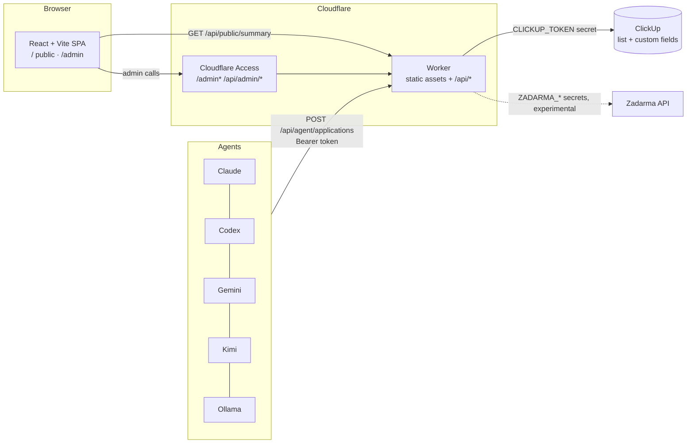

# Architecture

## Request flow

| Route | Auth | Purpose |
|---|---|---|
| `GET /api/public/summary` | none (sanitized, cached 60 s) | Public dashboard data |
| `GET /api/admin/tasks`, `PUT /api/admin/tasks/:id/status`, `POST /api/admin/tasks/:id/comments` | Cloudflare Access JWT + email allow-list | Manage the pipeline |
| `GET /api/admin/phone/stats` | same | Experimental Zadarma call stats |
| `POST /api/agent/applications` | per-agent bearer token | Agents log an application |
| everything else | none | Static SPA (single-page fallback) |

## Design decisions

- **One Worker for UI and API**: one deploy, one origin (no CORS), and `run_worker_first` keeps `/api/*` ahead of static assets.
- **ClickUp is the system of record**: resumes, docs and tasks stay where they already live; the Worker is a thin, stateless adapter.
- **Sanitize at the boundary**: `worker/src/sanitize.ts` is the only place data becomes public. Keep it small and reviewed.
- **No auth code to maintain**: login is delegated to Cloudflare Access; the Worker only verifies the signed token.
- **Agent identity from the token**: an agent can't claim to be another agent in the request body.
