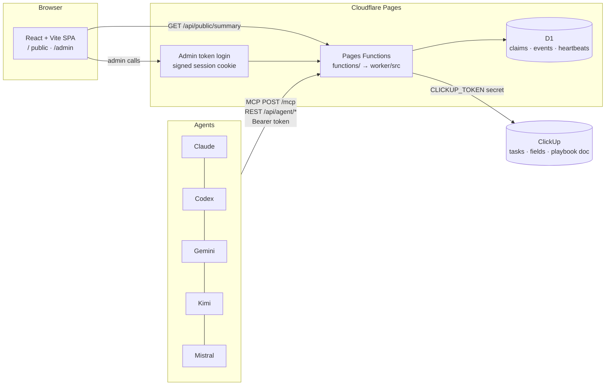

# Architecture

## Routes

| Route | Auth | Purpose |
|---|---|---|
| `GET /api/public/summary` | none (sanitized, cached 60 s) | Public dashboard data |
| `GET /api/health` | none | Config check (no secrets) |
| `POST /mcp` | agent bearer token | MCP server (stateless Streamable HTTP, JSON responses) |
| `/api/agent/*` | agent bearer token | Same operations over REST (see AGENTS.md) |
| `POST /api/admin/login` | `ADMIN_TOKEN` in body | Sets the admin session cookie |
| `/api/admin/*` | admin session cookie or `Bearer <ADMIN_TOKEN>` | Command center, pipeline edits, admin release/report |
| everything else | none | Static SPA (`dist/`, single-page fallback) |

## Queue and claims

- **Queue** = ClickUp subtasks of `PARENT_TASK_ID` with status *not started*. The description's `Apply: <url>` / `Pay | Travel | Fit | ATS` line is parsed for the posting details. Order: fit (x/5) desc, then ClickUp priority.
- **Claim** = a row in D1 `claims` taken with a single `INSERT … ON CONFLICT DO UPDATE … WHERE expired OR same agent` statement. The statement either changes one row (you won) or none (someone else holds it). No locks, no races.
- **Mirror**: a successful claim writes `Claimed by <agent> until <time>` to ClickUp *Next Action*. The queue also honours such notes written by agents that bypass the hub.
- **Leases expire** (`LEASE_MINUTES`, default 60), so a crashed agent's jobs return to the queue automatically. `claim_jobs` hands an agent the jobs it already holds first.
- **Reports** write status, Applied By, Platform Applied, Applied On and a comment to ClickUp, delete the claim and log an event. `applied` on a task that isn't *not started* is refused (409), so a late duplicate can't overwrite another agent's record.

## Design decisions

- **ClickUp stays the system of record.** D1 only holds coordination state that ClickUp is bad at (atomic leases, a high-frequency activity log, check-ins).
- **One service layer, two transports.** `worker/src/jobs.ts` implements every operation; `mcp.ts` and the REST routes are thin adapters, so MCP and REST agents behave identically.
- **Pages, not a standalone Worker.** Git integration deploys on push; `functions/` are one-line adapters into `worker/src/index.ts`, which still runs as a plain Worker if ever needed.
- **Sanitize at the boundary.** `worker/src/sanitize.ts` is the only place data becomes public.
- **One-person admin auth.** A single long random token (Pages secret) traded for an HMAC-signed HttpOnly cookie. No identity provider or dashboard setup; rotate the secret to log everyone out.
- **Agent identity from the token**, never from the request body.
